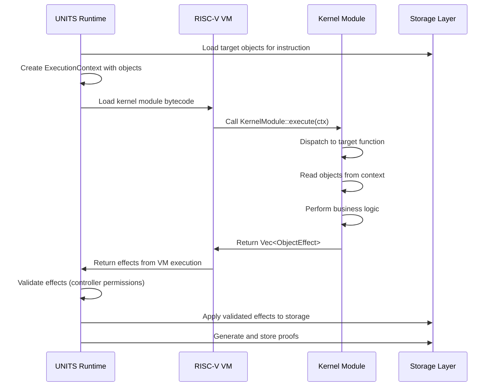
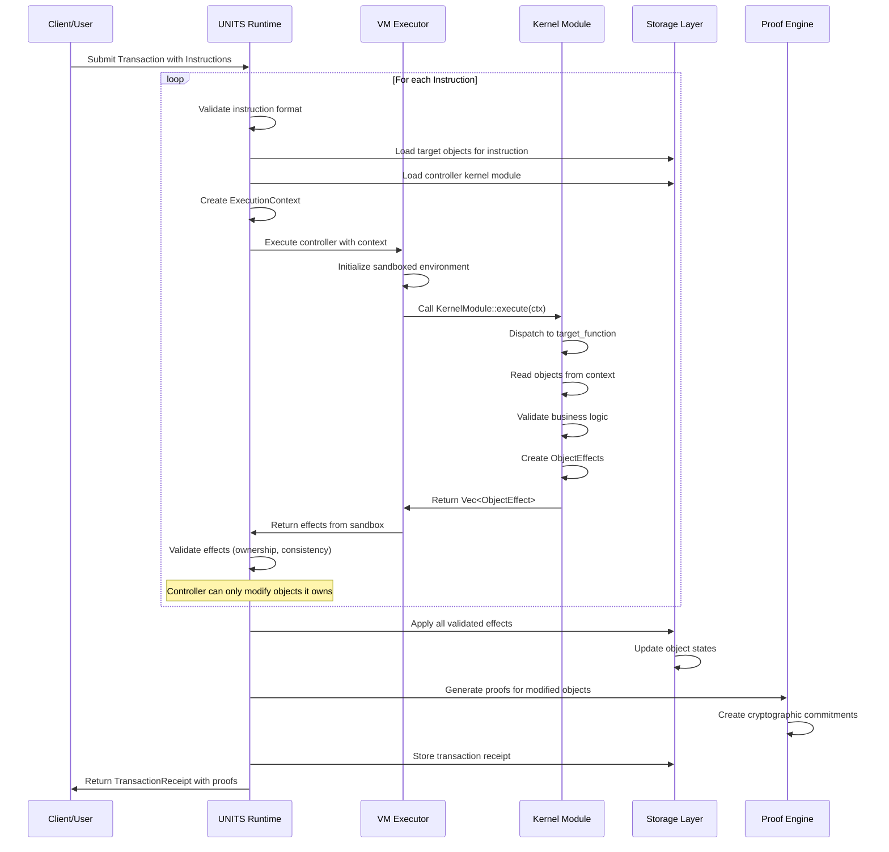
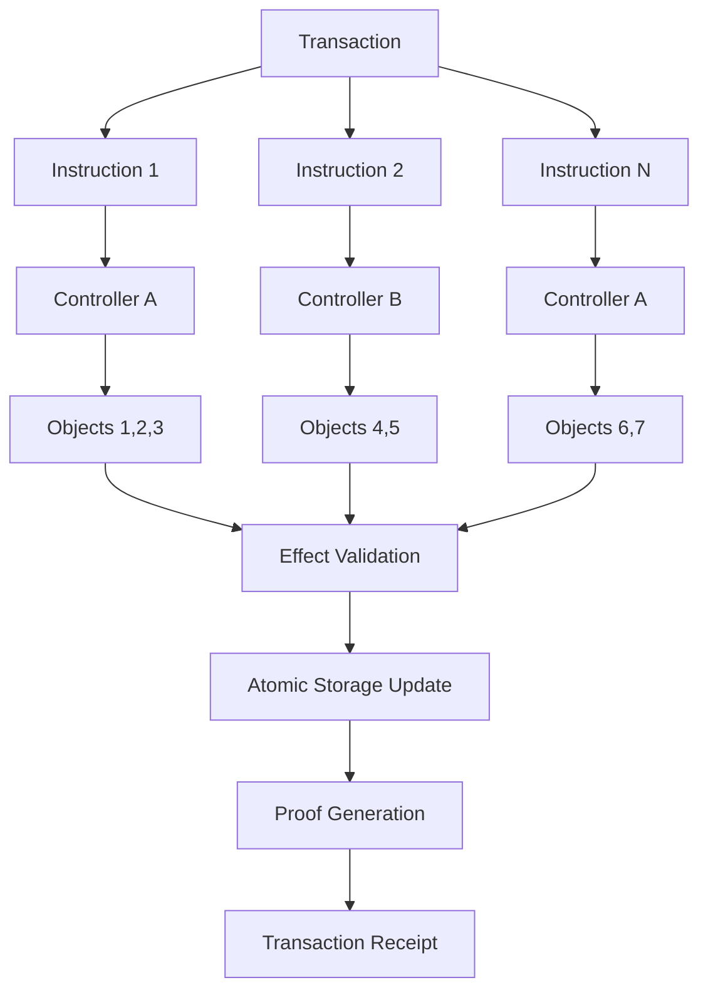
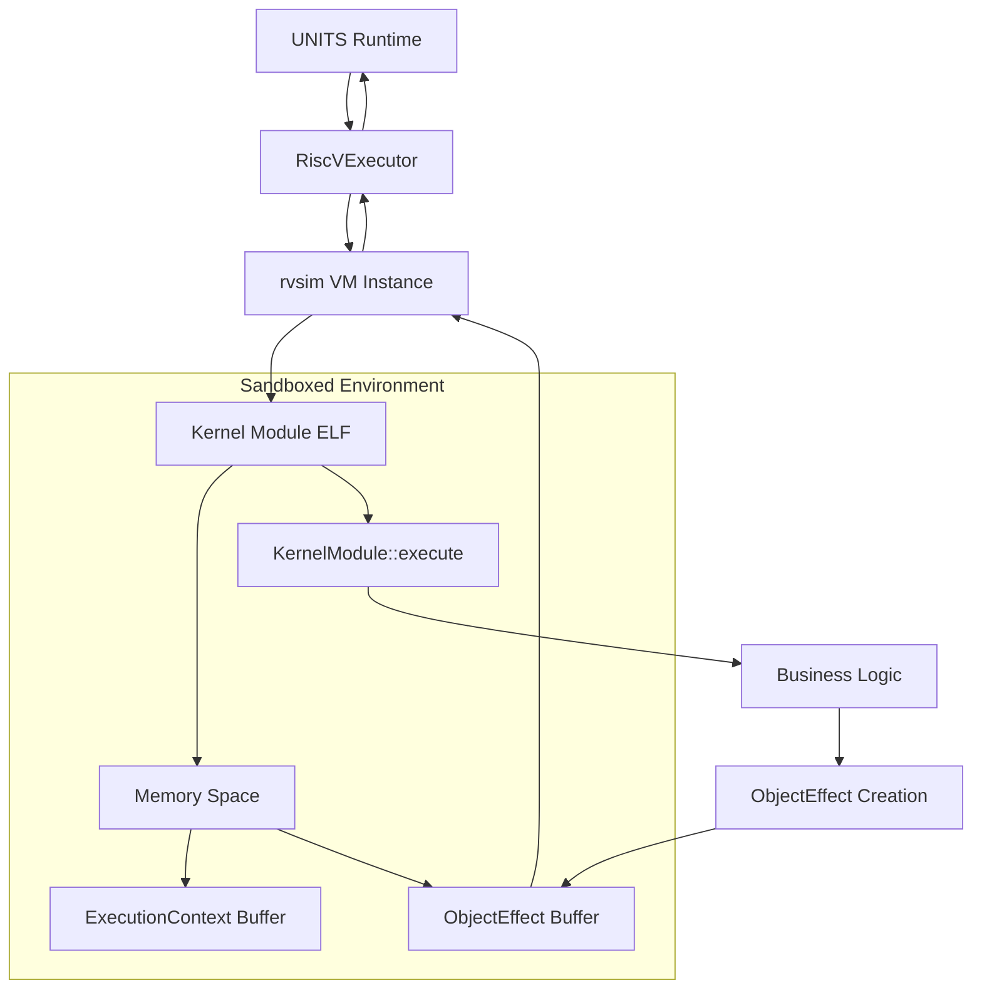
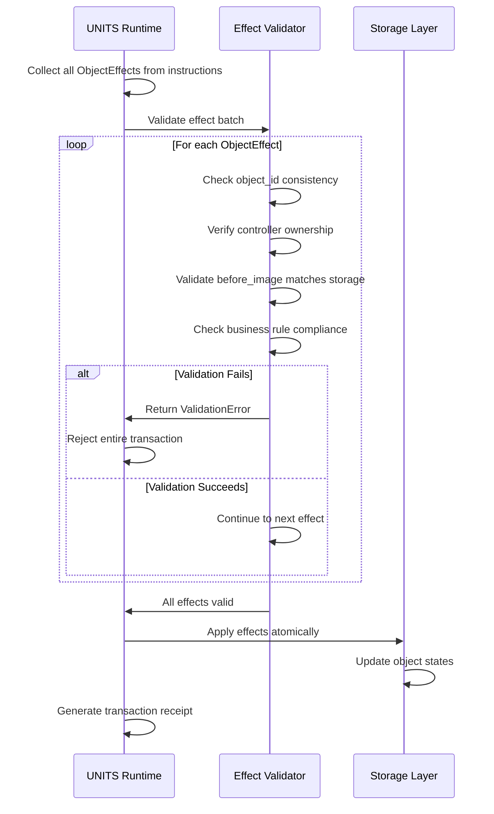
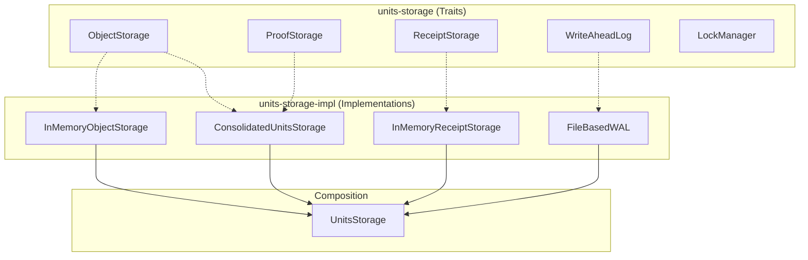
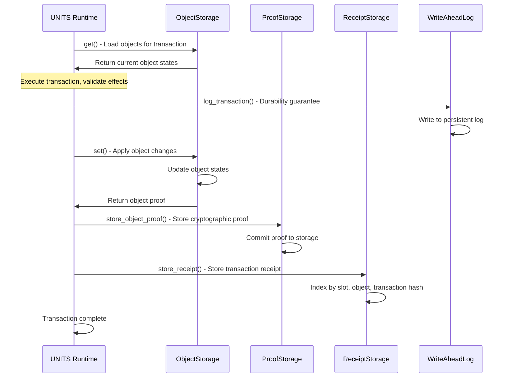

# UNITS Storage Architecture Specification

## Overview

This document specifies the unified object architecture for UNITS storage, where **everything is an object** with immutable controllers that define mutation rules through sandboxed execution.

## Core Principles

1. **Unified Object Model**: All entities (data, code, accounts, tokens) are UnitsObjects
2. **Controller-Based Security**: Each object has an immutable controller (kernel module) 
3. **Sandboxed Execution**: Controllers run in isolated VM environments (RISC-V, WASM, etc.)
4. **Storage Simplicity**: Single key-value store (UnitsObjectId → UnitsObject)
5. **Extensible VMs**: Support for multiple VM types via pluggable executors

## Object Model

### Core Structure

```rust
/// VM types for executable objects
/// Currently only RISC-V is implemented - other types are reserved for future extensions
#[derive(Debug, Clone, Copy, PartialEq, Eq, Serialize, Deserialize)]
#[non_exhaustive]
pub enum VMType {
    /// RISC-V ELF shared objects (currently implemented)
    RiscV,
    // Future VM types will be added here:
    // Wasm,   - WebAssembly modules (planned)
    // Ebpf,   - eBPF programs (planned) 
    // Native, - x86_64 native code (planned)
}

/// Object type distinguishing data from executable objects
#[derive(Debug, Clone, PartialEq, Eq, Serialize, Deserialize)]
pub enum ObjectType {
    /// Data object - not executable
    Data,
    /// Executable object with specific VM type
    Executable(VMType),
}

/// Unified object structure for all UNITS entities
#[derive(Debug, Clone, Serialize, Deserialize)]
pub struct UnitsObject {
    /// Unique identifier - how object is indexed in storage
    pub id: UnitsObjectId,
    
    /// Immutable controller - defines mutation rules for this object
    /// Points to another UnitsObject with ObjectType::Executable
    pub controller_id: UnitsObjectId,
    
    /// Object type - data or executable with VM specification
    pub object_type: ObjectType,
    
    /// Object payload: ELF/WASM/eBPF bytecode or arbitrary data
    pub data: Vec<u8>,
}
```

### System Constants

```rust
/// Hardcoded system controller IDs for bootstrap and security
/// Simple hardcoded values for initial implementation simplicity
pub const SYSTEM_LOADER_ID: UnitsObjectId = UnitsObjectId::new([0; 32]);
pub const TOKEN_CONTROLLER_ID: UnitsObjectId = UnitsObjectId::new([1; 32]);
pub const ACCOUNT_CONTROLLER_ID: UnitsObjectId = UnitsObjectId::new([2; 32]);
pub const MODULE_MANAGER_ID: UnitsObjectId = UnitsObjectId::new([3; 32]);
```

### Object Types by Usage

#### Kernel Modules (Controllers)
```rust
UnitsObject {
    id: controller_id,
    controller_id: SYSTEM_LOADER_ID,           // System loader controls kernel modules
    object_type: ObjectType::Executable(VMType::RiscV),
    data: risc_v_elf_bytes,                    // RISC-V ELF shared object
}
```

#### Data Objects  
```rust
UnitsObject {
    id: data_object_id,
    controller_id: TOKEN_CONTROLLER_ID,        // Token controller manages this data
    object_type: ObjectType::Data,
    data: token_balance_data,                  // Arbitrary binary data
}
```

## Execution Model

### VM Executor Interface

```rust
/// Abstract interface for different VM types
pub trait VMExecutor: Send + Sync {
    fn vm_type(&self) -> VMType;
    
    /// Load bytecode and execute with given context
    fn load_and_execute(
        &self,
        bytecode: &[u8],
        context: &ExecutionContext,
    ) -> Result<Vec<ObjectEffect>>;
}
```

### Execution Context

```rust
/// Complete context provided to controller during execution
#[derive(Debug, Clone, Serialize, Deserialize)]
pub struct ExecutionContext {
    /// The instruction being executed
    pub instruction: Instruction,
    
    /// Objects the controller can read/modify (pre-loaded from storage)
    /// Controllers can read any object but only modify objects they control
    pub objects: HashMap<UnitsObjectId, UnitsObject>,
    
    /// Current slot number
    pub slot: u64,
    
    /// Current timestamp
    pub timestamp: u64,
    
    
    // Note: env_vars field planned for future implementation
}

impl ExecutionContext {
    /// Get objects that this controller can modify (it controls)
    pub fn writable_objects(&self) -> impl Iterator<Item = (&UnitsObjectId, &UnitsObject)> {
        self.objects.iter().filter(|(_, obj)| {
            obj.controller_id == self.instruction.controller_id
        })
    }
    
    /// Get all objects (read-only + writable)
    pub fn all_objects(&self) -> &HashMap<UnitsObjectId, UnitsObject> {
        &self.objects
    }
}
```

### Controller Standard Interface

### Current Kernel Module Interface

All kernel modules in UNITS implement the `KernelModule` trait using the units-kernel-sdk framework:

```rust
#![no_std]
#![no_main]

use units_kernel_sdk::{
    use_default_allocator, KernelModule, KernelError,
    ExecutionContext, ObjectEffect, UnitsObjectId, UnitsObject
};

// Safe memory management - no unsafe code required
use_default_allocator!();

pub struct TokenModule;

impl KernelModule for TokenModule {
    /// Main execution entrypoint - dispatches to target functions
    fn execute(ctx: &ExecutionContext) -> Result<Vec<ObjectEffect>, KernelError> {
        match ctx.instruction.target_function.as_str() {
            "create_token" => Self::handle_create_token(ctx),
            "transfer_token" => Self::handle_transfer_token(ctx), 
            "mint_token" => Self::handle_mint_token(ctx),
            "burn_token" => Self::handle_burn_token(ctx),
            _ => Err(KernelError::UnknownFunction(ctx.instruction.target_function.clone())),
        }
    }
}

// Function implementations access ExecutionContext
impl TokenModule {
    fn handle_transfer_token(ctx: &ExecutionContext) -> Result<Vec<ObjectEffect>, KernelError> {
        // Read objects from context (pre-loaded by runtime)
        let sender_token = ctx.objects.get(&ctx.instruction.params.sender_id)
            .ok_or(KernelError::ObjectNotFound)?;
        let receiver_token = ctx.objects.get(&ctx.instruction.params.receiver_id)
            .ok_or(KernelError::ObjectNotFound)?;
            
        // Validate controller permissions
        if sender_token.controller_id != ctx.instruction.controller_id {
            return Err(KernelError::PermissionDenied);
        }
        
        // Create modified objects
        let new_sender = UnitsObject { /* updated balance */ };
        let new_receiver = UnitsObject { /* updated balance */ };
        
        // Return effects describing state changes
        Ok(vec![
            ObjectEffect::modification(sender_token.clone(), new_sender),
            ObjectEffect::modification(receiver_token.clone(), new_receiver),
        ])
    }
}
```

### Kernel Module Execution Flow



### Future VM Type Extensions

The architecture supports adding new VM types through the VMExecutor trait:

```rust
// Future WebAssembly executor implementation
pub struct WasmExecutor {
    runtime: WasmRuntime,
    memory_limit: usize,
}

impl VMExecutor for WasmExecutor {
    fn vm_type(&self) -> VMType { VMType::Wasm }
    
    fn load_and_execute(
        &self, 
        wasm_bytes: &[u8], 
        context: &ExecutionContext
    ) -> Result<Vec<ObjectEffect>> {
        // Load WASM module with same KernelModule trait interface
        // Execute in sandboxed WASM runtime
        // Return ObjectEffects from module execution
    }
}

// Future eBPF executor implementation  
pub struct EbpfExecutor {
    vm: EbpfVM,
    instruction_limit: u64,
}

impl VMExecutor for EbpfExecutor {
    fn vm_type(&self) -> VMType { VMType::Ebpf }
    
    fn load_and_execute(
        &self,
        ebpf_bytecode: &[u8],
        context: &ExecutionContext  
    ) -> Result<Vec<ObjectEffect>> {
        // Load eBPF program with standardized interface
        // Execute with instruction and memory limits
        // Return validated ObjectEffects
    }
}
```

### Object Effects

Controllers return object state changes from instruction execution. In the current implementation, `ObjectEffect` and `TransactionEffect` are unified:

```rust
/// Effect of controller execution on a single object
/// Represents before/after state for one object in an instruction
/// Note: This is currently aliased as TransactionEffect for compatibility
#[derive(Debug, Clone, Serialize, Deserialize)]
pub struct ObjectEffect {
    /// The object that was modified
    pub object_id: UnitsObjectId,
    
    /// State before instruction execution (None if object was created)
    pub before_image: Option<UnitsObject>,
    
    /// State after instruction execution (None if object was deleted)  
    pub after_image: Option<UnitsObject>,
}

// Current implementation aliases for compatibility
pub type TransactionEffect = ObjectEffect;

impl ObjectEffect {
    /// Create new object effect
    pub fn creation(object: UnitsObject) -> Self {
        Self {
            object_id: object.id,
            before_image: None,
            after_image: Some(object),
        }
    }
    
    /// Modify existing object effect
    pub fn modification(before: UnitsObject, after: UnitsObject) -> Self {
        Self {
            object_id: after.id,
            before_image: Some(before),
            after_image: Some(after),
        }
    }
    
    /// Delete object effect
    pub fn deletion(object: UnitsObject) -> Self {
        Self {
            object_id: object.id,
            before_image: Some(object),
            after_image: None,
        }
    }
}
```

### Effect Validation Rules

All ObjectEffects are validated before applying to storage:

1. **Ownership Validation**: Controller can only modify objects it controls
   - Effect object must have `controller_id` matching the executing controller
   
2. **ID Consistency**: Effect object_id must match target object
   - `effect.object_id == effect.object.id` for all effect types
   
3. **Type Preservation**: Controllers cannot arbitrarily change object_type
   - `object_type` changes require explicit business logic validation
   - System controllers have broader privileges for type changes
   
4. **Size Limits**: Objects have maximum size constraints
   - Default: 10MB per object data payload
   - Prevents resource exhaustion attacks

### Current Transaction Effect Implementation

In the current implementation, transaction effects are simplified to track single object changes:

```rust
/// Current unified effect structure for single object changes
/// Note: This represents the current implementation - future versions may
/// separate ObjectEffect and TransactionEffect for multi-object transactions
#[derive(Debug, Clone, Serialize, Deserialize)]
pub struct TransactionEffect {
    /// The transaction that caused this effect
    pub transaction_hash: TransactionHash,
    
    /// The single object that was modified
    pub object_id: UnitsObjectId,
    
    /// State before instruction execution (None if object was created)
    pub before_image: Option<UnitsObject>,
    
    /// State after instruction execution (None if object was deleted)  
    pub after_image: Option<UnitsObject>,
}
```

**Current Relationship**:
- **ObjectEffect**: Aliased to `TransactionEffect` in current implementation
- **TransactionEffect**: Single object's before/after state from one instruction
- **TransactionReceipt**: Contains `Vec<TransactionEffect>` for multi-object transactions

**Future Evolution**: The architecture reserves space for separating these concepts when implementing cross-controller communication and multi-object transactions.

## Transaction Execution Pipeline

### Complete Transaction Flow



### Detailed Execution Steps

1. **Transaction Submission**: Client submits transaction containing one or more instructions
2. **Instruction Processing**: For each instruction in the transaction:
   - Validate instruction format and controller existence
   - Load target objects from storage into ExecutionContext
   - Load controller kernel module bytecode from storage  
   - Create VM executor based on controller's VMType
3. **Sandboxed Execution**: 
   - Execute controller in isolated VM environment
   - Controller dispatches to target function based on instruction
   - Controller reads objects from context, performs business logic
   - Controller returns ObjectEffects describing state changes
4. **Effect Validation**: 
   - Verify controller can only modify objects it controls
   - Check object consistency and business rule compliance
   - Validate effect structure and object ID consistency
5. **State Application**:
   - Apply validated effects to storage atomically
   - Generate cryptographic proofs for all modified objects
   - Store transaction receipt with effects and proofs
6. **Receipt Return**: Return complete TransactionReceipt to client

### Multi-Instruction Transactions

UNITS supports transactions with multiple instructions for complex operations:



**Current Constraints:**
- Each instruction targets a single controller (cross-controller calls planned for future)
- All target objects from all instructions are pre-loaded into each ExecutionContext
- Controllers can read any object but only modify objects they control
- All effects from all instructions are validated before any storage changes

## VM Execution and Effect Validation

### RISC-V VM Execution Architecture

UNITS uses the `rvsim` crate for production-ready, sandboxed RISC-V execution:



**Key Security Features:**
- **Memory Isolation**: Each execution has isolated memory space with defined limits
- **Resource Limits**: Instruction count and execution time limits prevent DoS
- **No Direct Storage Access**: Controllers can only access pre-loaded objects in context
- **Deterministic Execution**: Same inputs always produce same outputs

### Effect Validation Flow



**Validation Rules:**
1. **ID Consistency**: `effect.object_id` must match `effect.after_image.id`
2. **Controller Ownership**: Only controllers can modify objects they own
3. **Before Image Accuracy**: `before_image` must match current storage state
4. **Type Preservation**: `object_type` changes require explicit validation
5. **Size Limits**: Object data payload must not exceed configured limits (default: 10MB)

### Instruction Format

```rust
/// Transaction instruction - call into controller entrypoint with target function
#[derive(Debug, Clone, Serialize, Deserialize)]
pub struct Instruction {
    /// The controller kernel module to execute
    pub controller_id: UnitsObjectId,
    
    /// Target function name within the controller (e.g., "transfer", "mint")
    pub target_function: String,
    
    /// Objects this instruction will read/modify (all objects controller needs access to)
    pub target_objects: Vec<UnitsObjectId>,
    
    /// Parameters for the specific function call
    pub params: Vec<u8>,
}
```

### Controller Access Patterns

**Read Access**: Controllers can read any object (no restrictions)
**Write Access**: Controllers can only write to objects they control

```rust
/// Validate controller access to target objects
fn validate_controller_access(instruction: &Instruction, storage: &dyn Storage) -> Result<()> {
    let controller_id = instruction.controller_id;
    
    for object_id in &instruction.target_objects {
        let object = storage.get(object_id)?;
        
        // Controllers can read any object, but can only write objects they control
        if object.controller_id != controller_id {
            // This object will be read-only for this controller
            // Write attempts will be caught during effect validation
        }
    }
    
    Ok(())
}

/// Validate that controller can only modify objects it controls
fn validate_object_effects(effects: &[ObjectEffect], controller_id: UnitsObjectId) -> Result<()> {
    for effect in effects {
        // If the object state changed, verify controller owns it
        if effect.before_image != effect.after_image {
            if let Some(after_obj) = &effect.after_image {
                if after_obj.controller_id != controller_id {
                    return Err("Controller cannot modify objects it doesn't control".into());
                }
            }
        }
    }
    
    Ok(())
}
```

## System Bootstrap

### Bootstrap Process

```
1. System starts with hardcoded SYSTEM_LOADER_ID
2. System loader is self-controlling (controller_id = SYSTEM_LOADER_ID)  
3. System loader loads other kernel modules from storage
4. Kernel modules are controlled by system loader
5. Data objects are controlled by appropriate kernel modules
```

### System Loader Responsibilities

- Parse and validate ELF files
- Load controllers into VM sandboxes
- Orchestrate controller execution
- Apply object effects to storage
- Generate transaction receipts and proofs

## VM Implementations

### RISC-V Executor (Current Implementation)

**Implementation**: Uses `rvsim` crate for production-ready, sandboxed RISC-V execution with ELF support.

```rust
pub struct RiscVExecutor {
    memory_limit: usize,        // Default memory limit for VM
    instruction_limit: u64,     // Maximum instructions per execution
    time_limit: Duration,       // Maximum execution time
}

impl VMExecutor for RiscVExecutor {
    fn vm_type(&self) -> VMType { VMType::RiscV }
    
    fn load_and_execute(
        &self, 
        elf_bytes: &[u8], 
        context: &ExecutionContext
    ) -> Result<Vec<ObjectEffect>> {
        // 1. Initialize rvsim VM with resource limits
        let mut vm = RvSimVM::new()
            .with_memory_limit(self.memory_limit)
            .with_instruction_limit(self.instruction_limit)
            .with_time_limit(self.time_limit);
            
        // 2. Load ELF binary (kernel module) into VM
        vm.load_elf(elf_bytes)?;
        
        // 3. Serialize ExecutionContext for kernel module
        let context_data = borsh::to_vec(context)?;
        vm.set_input_data(&context_data)?;
        
        // 4. Execute KernelModule::execute entrypoint
        let exit_code = vm.run()?;
        if exit_code != 0 {
            return Err(VMError::ExecutionFailed(exit_code));
        }
        
        // 5. Deserialize ObjectEffects returned by kernel module
        let output_data = vm.get_output_data()?;
        let effects: Vec<ObjectEffect> = borsh::from_slice(&output_data)?;
        
        Ok(effects)
    }
}
```

**Security Features:**
- **Memory Isolation**: Each VM instance has isolated memory space
- **Resource Limits**: Prevents DoS through instruction/time/memory limits  
- **Deterministic Execution**: Same inputs always produce same outputs
- **No System Access**: Kernel modules cannot access host system resources

### Future VM Extensions

The architecture supports adding new VM types through the VMExecutor trait without breaking existing code. This was already documented earlier in the "Future VM Type Extensions" section.

## Security Model

### Immutable Controllers
- Object's `controller_id` is set at creation and cannot be changed
- Provides security guarantee: controller logic cannot be bypassed
- Controller changes require creating new object with new controller

### Sandboxed Execution
- Controllers run in isolated VM environments
- No direct storage access - only through provided object context
- Resource limits (memory, instructions, time) enforced per execution
- All mutations captured as structured effects for validation

### System Controller Whitelist
- Hardcoded system controller IDs prevent privilege escalation
- System loader controls creation of new kernel modules
- Clear chain of trust from bootstrap to all objects

## Storage Architecture

### Trait-Based Storage Design

The storage system follows a **composition over inheritance** pattern with clear separation:



```rust
// units-storage: Trait definitions only
use units_storage::{
    ObjectStorage,     // Core object persistence
    ProofStorage,      // Cryptographic proof management  
    ReceiptStorage,    // Transaction receipt tracking
    WriteAheadLog,     // Optional durability logging
    LockManager,       // Concurrency control
};

// units-storage-impl: Concrete implementations
use units_storage_impl::{
    InMemoryObjectStorage,
    ConsolidatedUnitsStorage,
    InMemoryReceiptStorage,
};

// Compose storage capabilities as needed
let storage = UnitsStorage::new(
    ConsolidatedUnitsStorage::create(),
    Some(FileBasedWAL::new("/data/wal"))
);
```

**Benefits of This Design:**
- **55% reduction in trait complexity** (from ~1,800 lines to ~800 lines)
- **Single responsibility**: Each trait has one focused purpose
- **Easy testing**: Mock individual storage capabilities
- **Flexible composition**: Mix and match implementations

### Key-Value Mapping
```
UnitsObjectId (32 bytes) → UnitsObject (serialized)
```

### Object Proof Generation
- Each object mutation generates cryptographic proof
- Proofs commit to before/after object states  
- Slot-level aggregation of all object proofs
- Complete audit trail of all mutations

### Storage Operation Flow



### Current Transaction Effect Storage
```rust
// Current implementation stores individual object effects
pub struct TransactionEffect {
    pub transaction_hash: TransactionHash,
    pub object_id: UnitsObjectId,
    pub before_image: Option<UnitsObject>, 
    pub after_image: Option<UnitsObject>,
}

// Storage in TransactionReceipt
pub struct TransactionReceipt {
    pub transaction_hash: TransactionHash,
    pub effects: Vec<TransactionEffect>,  // One effect per modified object
    pub proofs: Vec<ObjectProof>,
    pub slot: u64,
    pub timestamp: u64,
}
```

## References

- RISC-V Specification: https://riscv.org/specifications/
- ELF Format: https://refspecs.linuxfoundation.org/elf/elf.pdf
- WebAssembly: https://webassembly.org/
- eBPF: https://ebpf.io/
